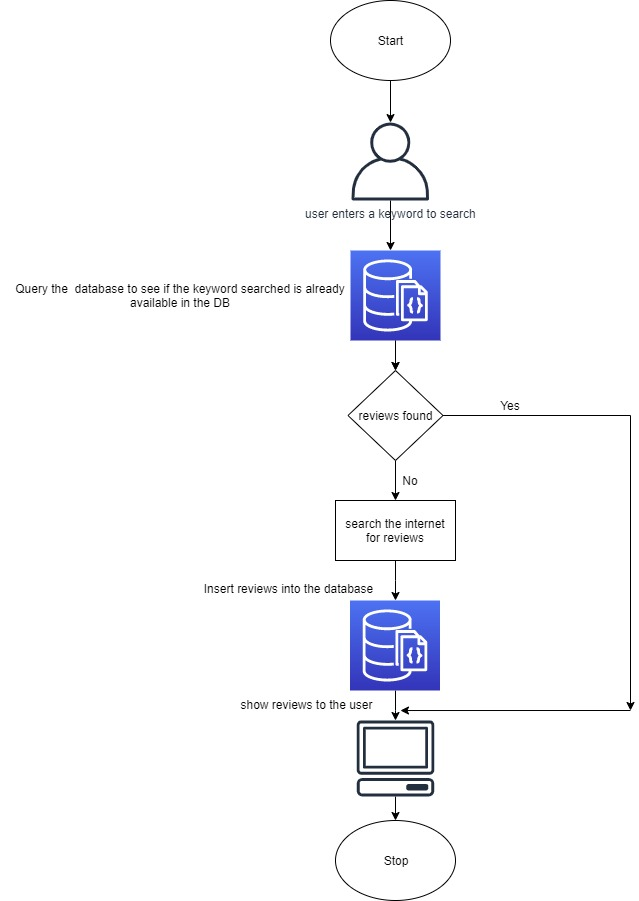

# ReviewScrapper

## Review scraper from scratch till deployment
### 1.	Prerequisites:
The things needed before we start building a python based web scraper are:
1.	Python installed.
2.  A Python IDE (Integrated Development Environment): like PyCharm, Spyder, or any other IDE of choice (Explained Later)
3.	Flask Installed. (A simple command: pip install flask)
4.	MongoDB installed (Explained Later).
5.	Basic understanding of Python and HTML.
6.	Basic understanding of Git (download Git CLI from https://gitforwindows.org/ )

6.	Heroku Basics:
1.	We’ll first go to heroku.com, and we’ll create a new account if we already don’t have one.
2.	We’ll download and install the Heroku CLI from the Heroku website: https://devcenter.heroku.com/articles/heroku-cli.
## 2.	Steps before cloud deployment:
We need to change our code a bit so that it works unhindered on the cloud, as well.
1. Add a file called ‘gitignore’ inside the ‘reviewScrapper’ folder. This folder contains the list of the files which we don’t want to include in the git repository. My gitignore file looks like:
.idea
As I am using PyCharm as an IDE, and it’s provided by the Intellij Idea community, it automatically adds the .idea folder containing some metadata. We need not include them in our cloud app.
2. 	Add a file called ‘Procfile’ inside the ‘reviewScrapper’ folder. This folder contains the command to run the flask application once deployed on the server:

web: gunicorn app:app
Here, the keyword ‘web’ specifies that the application is a web application. And the part ‘app:app’ instructs the program to look for a flask application called ‘app’ inside the ‘app.py’ file. Gunicorn is a Web Server Gateway Interface (WSGI) HTTP server for Python.

3. 	Open a command prompt window and navigate to your ‘reviewScrapper’ folder. Enter the command ‘pip freeze > requirements.txt’. This command generates the ‘requirements.txt’ file. My requirements.txt looks like:

> beautifulsoup4==4.8.1
 bs4==0.0.1
 certifi==2019.9.11
 Click==7.0
 Flask==1.1.1
 Flask-Cors==3.0.8
 gunicorn==20.0.4
 itsdangerous==1.1.0
 Jinja2==2.10.3
 MarkupSafe==1.1.1
 numpy==1.17.4
 opencv-python==4.1.2.30
 Pillow==6.2.1
 pymongo==3.9.0
 requests==2.21.0
 requests-oauthlib==1.2.0
 six==1.13.0
 soupsieve==1.9.5
 Werkzeug==0.16.0
requirements.txt helps the Heroku cloud app to install all the dependencies before starting the webserver.

5.	We have created a new file ‘app.py’ inside the review scrapper folder:
 
*	Remove the first_flask.app file from the directory. Resulting folder structure:
 
*	A default route has been added to the app.py file to direct  to the home page when the application is initially invoked as shown below:
@app.route('/',methods=['GET'])  # route to display the home page
@cross_origin()
def homePage():
    return render_template("index.html")

*	We have removed the part where we were writing to MongoDB. Consuming MongoDB might incur charges. So, we have removed that part. 
*	
## 3.	Heroku app creation and deployment
a.	After installing the Heroku CLI, Open a command prompt window and navigate to your ‘reviewScrapper’ folder. 
b.	Type the command ‘heroku login’ to login to your heroku account as shown   below: 
 
c.	After logging in to Heroku, enter the command ‘heroku create’ to create a heroku app. It will give you the URL of your Heroku app after successful creation.
d.	Before deploying the code to the Heroku cloud, we need to commit the changes to the local git repository.
e.	Type the command ‘git init to initialize a local git repository  as shown below:
 
f.	Enter the command ‘git status’ to see the uncommitted changes
g.	Enter the command ‘git add .’ to add the uncommitted changes to the local repository.
h.	Enter the command ‘git commit -am "make it better"’ to commit the changes to the local repository.
i.	Enter the command ‘git push heroku master’ to push the code to the heroku cloud.
j.	After deployment, heroku gives you the URL to hit the web API.
k.	Once your application is deployed successfully, enter the command ‘heroku logs --tail’ to see the logs.
