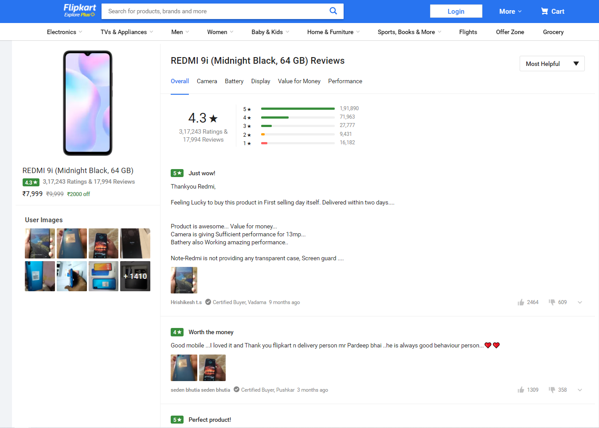

# ReviewScrapper

## Review scraper from scratch till deployment
### 2.	Prerequisites:
The things needed before we start building a python based web scraper are:
•	Python installed.
•	A Python IDE (Integrated Development Environment): like PyCharm, Spyder, or any other IDE of choice (Explained Later)
•	Flask Installed. (A simple command: pip install flask)
•	MongoDB installed (Explained Later).
•	Basic understanding of Python and HTML.
•	Basic understanding of Git (download Git CLI from https://gitforwindows.org/ )
